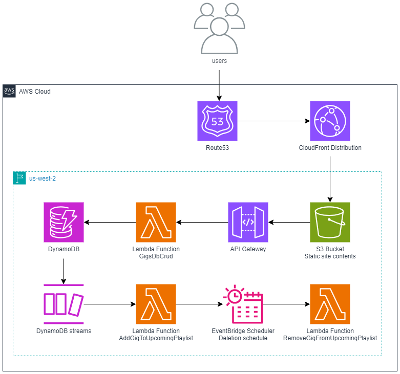

# Giglist
#### *Spotify playlists for your gig calendar*


## Features

Giglist creates Spotify playlists containing the 10 ten tracks by artists you're going to see live.

## Design

Giglist has an Angular frontend hosted as a static site in an S3 bucket behind a CloudFront distribution.
Gigs are stored in a DynamoDB table. 
Gig CRUD operations are performed via an API Gateway REST API, which triggers a Lambda function.
The addition of a new gig triggers a Lambda function via DynamoDB streams.
This Lambda adds songs to a user's upcoming gigs playlist using the Spotify API and 
schedules the deletion of these songs by setting up an EventBridge Scheduler schedule to trigger another 
Lambda function the day after the gig.



## Project Organisation

### Source

The backend Python source directories are `functions` (contains Lambda function code, organised by function) and `libs`
(contains Python code that is shared across > 1 Lambda). Set these as source directories in PyCharm to remove false
import errors.

The frontend Angular source is in `frontend`. It can be run locally using the Angular CLI:
```commandline
cd frontend
npm install
ng serve
```

### Test

Tests are organised in the `tests` directory.
```
tests
├── integration
├── resources
└── unit
```

Tests are run with pytest. Running `pytest` in the root directory of the project will run all integration and unit tests.

### CI/CD

CI/CD is performed using GitHub Actions. Workflows are located in `.github/workflows`.

### Deploy

The backend currently uses **Python 3.12**. 

It can be deployed using the AWS SAM CLI:
```commandline
sam build -t template.yaml
sam deploy --config-env dev
```