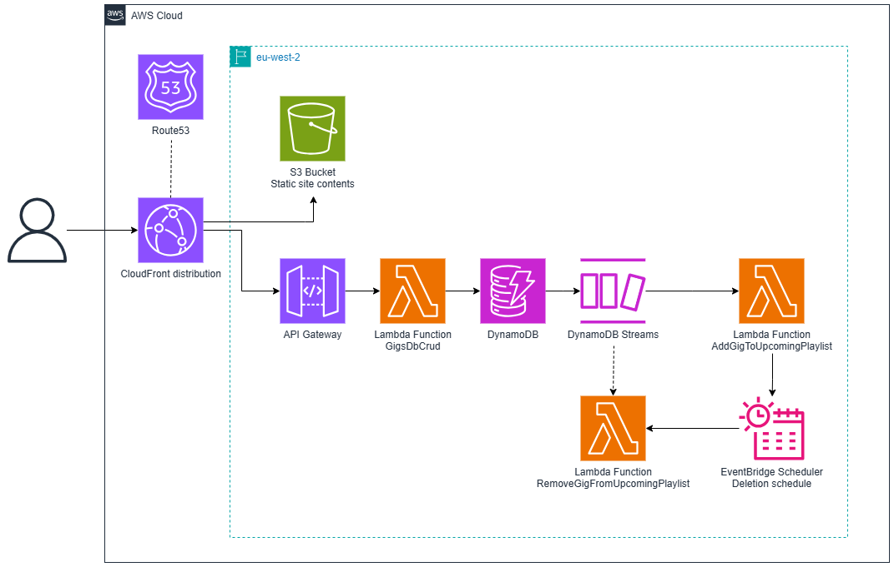

# Giglist
#### *Spotify playlists for your gig calendar*

## Features

Giglist creates Spotify playlists containing the 10 ten tracks by artists you're going to see live.

## Design

Giglist has an Angular frontend hosted as a static site in an S3 bucket behind a CloudFront distribution.
Gigs are stored in a DynamoDB table. 
Gig CRUD operations are performed via an API Gateway REST API, which triggers a Lambda function.
The addition of a new gig triggers a Lambda function via DynamoDB streams.
This Lambda adds songs to a user's upcoming gigs playlist using the Spotify API and 
schedules the deletion of these songs by setting up an EventBridge Scheduler schedule to trigger another 
Lambda function the day after the gig.

